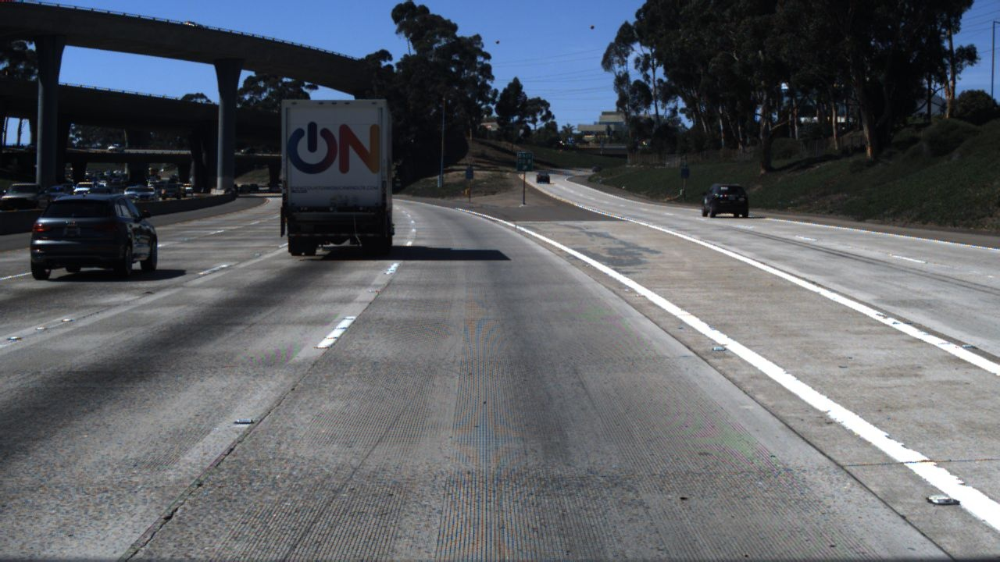
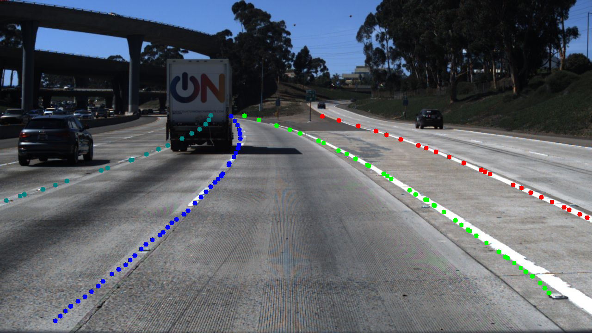
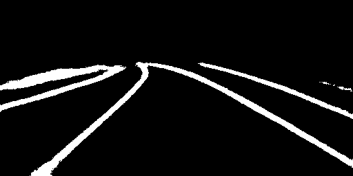
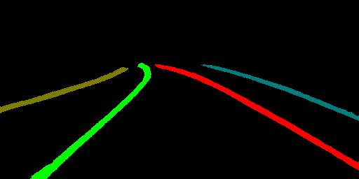
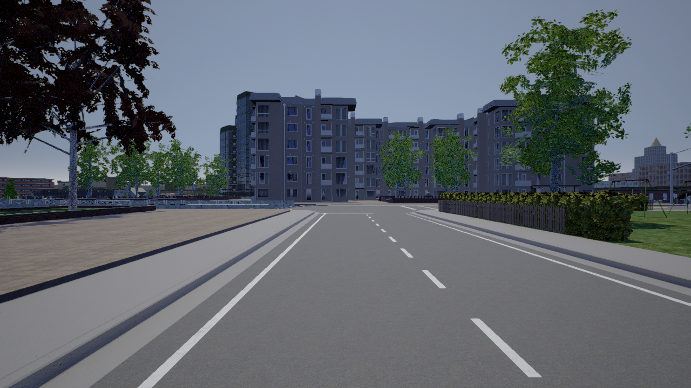
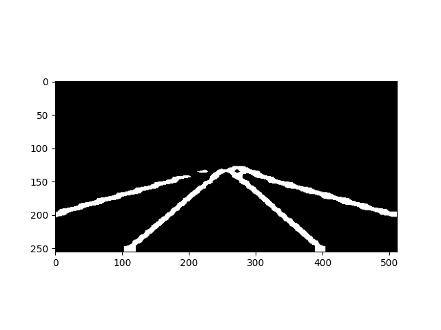
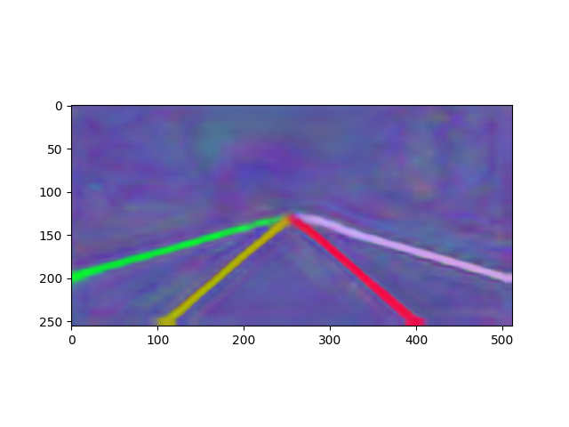
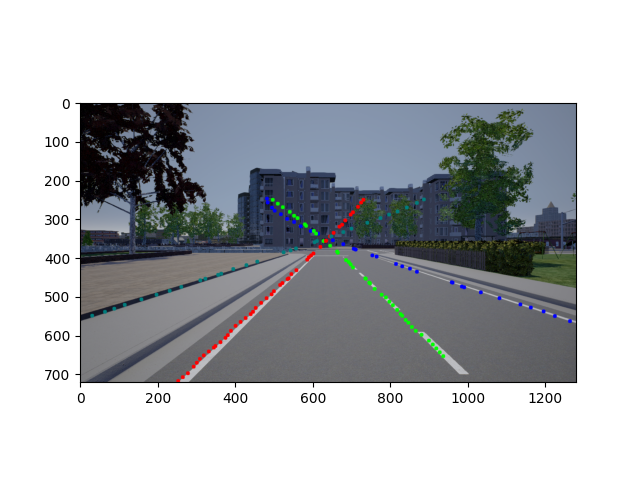
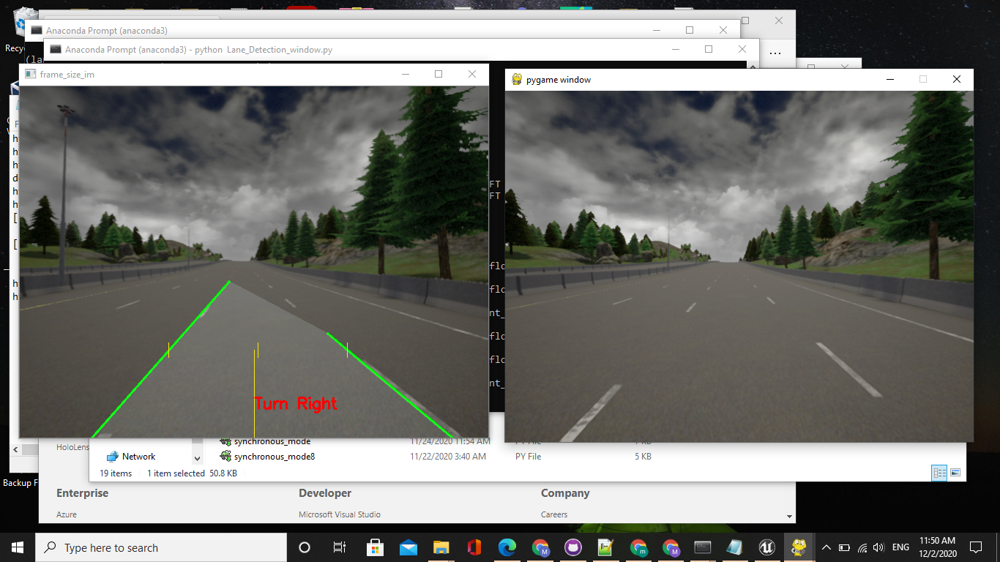

# Lane Detection-LaneNet
Tensorflow implementation of deep neural network for real time lane detection-LaneNet model.


LaneNet architecture consist of encoder-decoder network ENet that modified into two branched network, binary segmentation branch and instance segmentation embedding branch.


## Preliminary Setup
The project was implement on IDE Pycharm by configuring a conda environment of tensorflow 1.14 and the requirment below:
### Requirements 
- python3.7
- numpy
- tqdm
- glog
- easydict
- matplotlib
- opencv
- scikit_learn
- loguru

## LaneNet-Tusimple Benchmark Dataset
Tusimple dataset release about 7,000 one-second-long video clips of 20 frames each, The advantage of tusimple it provid the files .json the labelled lanes pixels of each image.

The dataset is available [here](https://github.com/TuSimple/tusimple-benchmark/issues/3) move them to the folder data/Tusimple
```
Tusimple
├── clips
├── label_data_0313.json
├── label_data_0531.json
├── label_data_0601.json
└── test_label.json
```

#### Data Preparation
The training folder should contain three folder consist of the orignal image, binary segmentation use 255 for representating the lane, and the instance segmentation use different pixel value to label each lane pixel with a lane Id
run the script:

```
python tools/generate_tusimple_dataset.py --src_dir data/Tusimple
```
the script will generate a folder called training contain the three components of orginal rgb image,binary label image, instance label image.  
And process the train.txt where from train.txt we select several lines to obtain the val.txt.
The training image scaled with [512,256] before starting train modify the file config with adding all the paths 

#### Pretrained Model 
Due to my low PC performance and CPU memory the train of the model fail 

code for train:
```
python tools/train_lanenet_tusimple.py 
```  

I download a pretrained model [here](https://www.dropbox.com/sh/0b6r0ljqi76kyg9/AADedYWO3bnx4PhK1BmbJkJKa?dl=0)
and put it in a new folder model/tusimple_lanenet.

for testing the model we run the command:
```
python tools/test_lanenet.py --weights_path model/tusimple_lanenet/tusimple_lanenet.ckpt
--image_path data/tusimple_test_image/0.jpg
```
The results are as follows:

`Test Input Image`



`Test Lane Mask Image`



`Test Lane Binary Segmentation Image`



`Test Lane Instance Segmentation Image`




## Carla Simulation (0.9.4-0.9.8)
The main work on carla with to collect different scenarios, weather, pedestrian and cars from different towns in carla

first i was collecting the images from Carla 0.9.4:


Download Carla 0.9.4 [here](https://github.com/carla-simulator/carla/releases)

```
#Run Carla
cd Carla-0.9.4
CarlaUE4.exe town01 -ResX=30 -ResY=30
```
open another terminal
```
#specify number of car
cd Carla-0.9.4
python spawn_npc.py - n 50
```
50 is the number of cars

 open Another terminal
```
#change the weather by time 
cd Carla-0.9.4
python dynamic_weather.py 
```
open another terminal

```
#collecting images 
cd Carla-0.9.4
python synchronous_mode0.4.py
```
the script open a pygame window and the car drive automatically, each fram took 1s

#### Carla 0.9.8

Download Carla 0.9.8 [here](https://github.com/carla-simulator/carla/releases)

In Case of carla 0.9.8 collect camera, depth, and semantic segmentation ground truth data.

```
 #run Carla
cd Carla-0.9.8
CarlaUE4.exe town04 -ResX=30 -ResY=30
```
```
# specify number of car and pedestrian
cd Carla-0.9.8
python spawn_npc.py - n 50 -w 30
```
50 cars 30 pedestrian

```
#change the weather by time 
cd Carla-0.9.8
python dynamic_weather.py 
```
```
#collecting images 
cd Carla-0.9.8s
python synchronous_mode.py
```
you cane change the weather by running the manual control.Finally i collect 4 different scenario from carla 0.9.4-0.9.8 

#### Results 
[scenario-town1](https://drive.google.com/drive/folders/128tcsFxrl0szV38DdWNvUzj2Osvp_odc).

[scenario-town2](https://drive.google.com/drive/folders/1qiBYl0wkQvdrqPscdtc-E2ljaTDw2Kok)

[scenario-town3](https://drive.google.com/drive/folders/1NhIBWroFArrGjdPYMNMFMk9Pci-6EIGz)

[scenario-town4](https://drive.google.com/drive/folders/1NhIBWroFArrGjdPYMNMFMk9Pci-6EIGz)

## LaneNet-Carla Dataset
Test the pretrained model on carla single image
```
python tools/test_lanenet.py --weights_path model/tusimple_lanenet/tusimple_lanenet.ckpt
--image_path data/tusimple_test_image/00005360.png
```
 
`Test Input Image`



`Test Lane Binary Segmentation Image`



`Test Lane Instance Segmentation Image`



`Test Lane Mask Image`



## test laneNet on the Scenarios of Carla
evaluate the model on the whole Carla scenarios, after collecting the scenarios save them in a folder Carla_Dataset

run the command:
```
python tools/evaluate_lanenet_on_tusimple.py 
--image_dir Carla_Dataset/town1 
--weights_path  model/tusimple_lanenet/tusimple_lanenet.ckpt
--save_dir Carla_Dataset/town1-LaneNet
```
set the save_dir where our result will be saved u can found the results here for the 4 scenarios
[town1-LaneNet](https://drive.google.com/drive/folders/128tcsFxrl0szV38DdWNvUzj2Osvp_odc)


[town2-LaneNet](https://drive.google.com/drive/folders/1qiBYl0wkQvdrqPscdtc-E2ljaTDw2Kok)

[town3-LaneNet](https://drive.google.com/drive/folders/123-qXar0hNzUshIs0jjY3GCbSipSCJHY)

[town4-LaneNet]()

## Lane Detection on carla

in this part provid a lane detection algorithm using opencv on Carla 0.9.8.
Commands:
```
 #run Carla
cd Carla-0.9.8
CarlaUE4.exe -ResX=30 -ResY=30
```
```

# add cars and pedestrian
cd Carla-0.9.8
python spawn_npc.py - n 90 -w 30
```

```

python Lane_Detection_window.py 
```

#### Results 

`Test Lane Detection`



`recording video for lane detection `

[here](https://drive.google.com/drive/folders/1lKxf46SZzCNxluN-XEGIdr4oNzca1Nxl)


